# SKALA-VUE 과제 통합 정리

vue.js 과제 실습

작성자 : 조해수 (P168) 판교 4기 5반

## 목차

1. [Hands on - Project Scaffolding](#part-1)
2. [Hands on -](#part-1) [Weather Mockup 수행 환경 정리](#part-2)
3. [Hands on -](#part-1) [Weather Composition (Composition API)](#part-3)
4. [Hands on -](#part-1) [Weather Component (컴포넌트 분리)](#part-4)
5. [Hands on -](#part-1) [Weather Router (Vue Router)](#part-5)
6. [Hands on -](#part-1) [Weather Store (Pinia)](#part-6)
7. [Hands on -](#part-1) [Weather Axios (외부 API 연동)](#part-7)
8. [Weather UI Library - daisyUI](#part-8-2)
   8-2. 번외 [Hands on -](#part-1) [Weather API Library - 기상청 METAR](#part-8) ... 목업 대신 외부 데이터 API 사용해보았습니다.
9. [Hands on -](#part-1) [Weather Deployment (Build & Hosting)](#part-9)

***

들어가기 전에

## 전체 실행 흐름

**`main.js`가 Vue 앱을 시작하고 → `App.vue`가 전체 틀을 만들고 → Router가 `views`를 선택하며 → 각 View가 `components`를 조립하고 → Pinia가 공통 상태를 관리하며 → Axios/Utils가 외부 날씨 데이터를 공급하는 구조**입니다.

```
index.html
    │
    ▼
main.js
    │
    ├─ Pinia
    ├─ Router
    └─ UI Library
    │
    ▼
App.vue
    │
    ▼
RouterView
    │
    ▼
router/index.js
    │
    ├─ WeatherHomeView
    │      │
    │      ├─ SearchBar
    │      ├─ WeatherCard
    │      │     └─ FavoriteButton
    │      └─ Pinia Store
    │
    ├─ WeatherDetailView
    │      └─ Pinia Store
    │
    ├─ WeatherAboutView
    ├─ WeatherStatsView
    └─ NotFoundView
           │
           ▼
        API / Utils
           │
           ├─ OpenWeatherMap
           ├─ KMA METAR
           └─ weatherCache
```

***

# 1. Hands on - Project Scaffolding

## 1. Local Development Environment

Vue 프로젝트 개발을 위한 로컬 개발 환경을 구성한다.

### 1.1 WSL2 / Ubuntu 설치

> Windows 사용자만 해당
> Windows 환경에서는 WSL2 및 Ubuntu를 설치하여 Linux 기반 개발 환경을 구성한다.

### 1.2 Node.js 설치 및 버전 확인

Node.js와 npm이 정상적으로 설치되었는지 확인한다.

```
node -v
# v26.5.0

npm -v
# 12.0.1
```

* **Node.js**: JavaScript를 브라우저 외부 환경에서 실행할 수 있도록 하는 JavaScript Runtime

* **npm (Node Package Manager)**: Node.js 프로젝트에서 외부 라이브러리와 의존성을 관리하는 패키지 관리 도구

### 1.3 VS Code Extension 설치

Vue 개발을 위해 다음 VS Code Extension을 설치하였다.

* Vue

* ESLint

* Prettier

* WSL Extension *(Windows 사용자)*

***

## 2. Project Scaffolding

### 2.1 `skala-vue` 프로젝트 생성

Vue 기반의 `skala-vue` 프로젝트를 생성하고 GitHub Repository와 연결한다.

프로젝트 디렉터리로 이동한다.

```
cd /Users/haesoocho/w9/skala-vue
```

또는 상위 디렉터리에서 다음과 같이 이동할 수 있다.

```
cd skala-vue
```

### 2.2 프로젝트 의존성 설치

```
npm install
```

`npm install`은 프로젝트 루트의 `package.json` 파일을 확인하여 프로젝트 실행에 필요한 외부 패키지를 설치한다.

설치된 패키지는 기본적으로 `node_modules` 디렉터리에 저장된다.

```
package.json
     │
     ▼
npm install
     │
     ▼
외부 라이브러리 다운로드
     │
     ▼
node_modules 생성
```

실행 결과:

```
➜  skala-vue git:(main) npm install

added 302 packages, and audited 303 packages in 2s

82 packages are looking for funding
  run `npm fund` for details

4 high severity vulnerabilities

To address all issues, run:
  npm audit fix

Run `npm audit` for details.
```

> `npm install`은 Node.js 자체를 설치하는 명령어가 아니라, **현재 프로젝트의 의존성 패키지를 설치하는 명령어**이다.

***

## 3. ESLint / Prettier 적용

코드 스타일을 통일하고 가독성을 유지하기 위해 ESLint와 Prettier를 적용한다.

### Prettier 실행

```
npm run format
```

실행 결과:

```
➜  skala-vue git:(main) npm run format

npm notice run skala-vue@0.0.0 format
npm notice run prettier --write --experimental-cli src/
```

### 역할

* **ESLint**: JavaScript/Vue 코드의 문법 오류 및 코드 품질 검사

* **Prettier**: 들여쓰기, 공백, 줄바꿈 등의 코드 포맷 자동 정리

***

## 4. Local Development Server 실행

다음 명령어로 Vue 개발 서버를 실행한다.

```
npm run dev
```

`npm run dev`는 `package.json`의 `scripts`에 정의된 Vite 개발 서버를 실행한다.

```
npm run dev
     │
     ▼
package.json의 scripts 확인
     │
     ▼
Vite 실행
     │
     ▼
Vue 소스 컴파일
     │
     ▼
Local HTTP Server 실행
```

실행 결과:

```
➜  skala-vue git:(main) npm run dev

npm notice run skala-vue@0.0.0 dev
npm notice run vite --host

VITE v8.0.16 ready in 926 ms

➜  Local:   http://localhost:3000/
➜  Network: http://10.250.175.90:3000/
➜  Vue DevTools: Open http://localhost:3000/__devtools__/ as a separate window
➜  Vue DevTools: Press Option(⌥)+Shift(⇧)+D in App to toggle the Vue DevTools
➜  press h + enter to show help
```

브라우저에서 다음 주소에 접속하여 프로젝트가 정상적으로 동작하는지 확인한다.

```
http://localhost:3000/
```

> 실제 실행 로그에서 Vite 개발 서버가 `3000` 포트로 실행되었으므로 본 문서에서는 `localhost:3000`을 기준으로 작성하였다.

***

## 5. 주요 npm 명령어

| 명령어              | 역할                           |
| :--------------- | :--------------------------- |
| `node -v`        | Node.js 버전 확인                |
| `npm -v`         | npm 버전 확인                    |
| `npm install`    | `package.json` 기반 의존성 패키지 설치 |
| `npm run format` | Prettier를 이용한 코드 포맷팅         |
| `npm run dev`    | Vite 기반 로컬 개발 서버 실행          |

***

## 6. HMR (Hot Module Replacement)

### 6.1 HMR이란?

\*\*HMR (Hot Module Replacement)\*\*은 개발 서버를 재시작하거나 브라우저를 새로고침하지 않아도 수정한 소스 코드가 실행 중인 화면에 즉시 반영되는 기능이다.

Vite는 Vue 프로젝트 개발 시 HMR 기능을 지원한다.

```
Vue 파일 수정
    │
    ▼
Vite가 변경 감지
    │
    ▼
변경된 Module만 교체
    │
    ▼
Browser 화면 즉시 반영
```

### 6.2 HMR 동작 확인

1. VS Code에서 `skala-vue` 프로젝트를 연다.
2. 개발 서버를 실행한다.

```
npm run dev
```

3. 브라우저에서 다음 주소에 접속한다.

```
http://localhost:3000/
```

4. `AboutView` 화면을 확인한다.
5. 다음 파일을 수정한다.

```
src/views/AboutView.vue
```

6. `<template>` 영역의 내용을 변경한다.

예시:

```
<template>
  <div>
    <h1>This is an About Page</h1>
  </div>
</template>
```

7. 파일 저장 후 브라우저 화면이 새로고침 없이 즉시 변경되는지 확인한다.

이를 통해 Vue + Vite 환경에서 **HMR이 정상적으로 동작하고 있음을 확인**할 수 있다.

***

## 7. 실습 결과

* Node.js / npm 개발 환경 구성 완료

* VS Code Vue 개발 Extension 구성 완료

* `skala-vue` 프로젝트 생성 및 GitHub Repository 연결

* `npm install`을 통한 프로젝트 의존성 설치

* ESLint / Prettier 적용

* Vite 개발 서버 정상 실행

* Vue 프로젝트 브라우저 동작 확인

* `AboutView.vue` 수정을 통한 HMR 동작 확인

***

<br />

# 2. Hands on - Weather Mockup 수행 환경 정리

<br />

## 수행 환경 / 실행 방법

제공받은 `App.vue.exercise`를 복제 후 복제한 파일명을 `App.vue`로 변경하여 과제 수행용 파일로 사용였다. (참고로 기존에 제공된 `main.js`에서는 `App.vue`파일을 Root Component로 기지정되었다.)

```
src/
├── App.vue                 ← 실제 실행 파일
├── App.vue.exercise        ← 과제용 원본/백업
├── App.vue.default
├── App.vue.1nd
├── App.vue.2nd
├── App.vue.3rd
└── main.js
```

<br />

참고 `main.js`

```
import App from './App.vue'
const app = createApp(App)
app.mount('#app')
```

***

Mock Data 개요

\[1] 습도, 풍속, 날씨 아이콘 데이터 추가

\[2] 날씨 별 시각화 기능 추가 --- 날씨(맑음/비/눈/구름) 별 아이콘, 배경색 시각화 기능 및 안내메세지 추가

* 맑음 → icon:☀️ + background\_color:밝은 노랑/하늘 배경 + message: “야외활동하기 좋아요

* 비 → icon: 🌧️ + background\_color: 푸른 회색 배경 + message: “우산을 챙기세요”

* 눈 → icon:❄️ + background\_color: 밝은 하늘/흰 배경 + message: “미끄럼 주의”

* 구름 → icon:☁️ + background\_color:회청색 배경. + message: “선선한 하루예요”

<br />

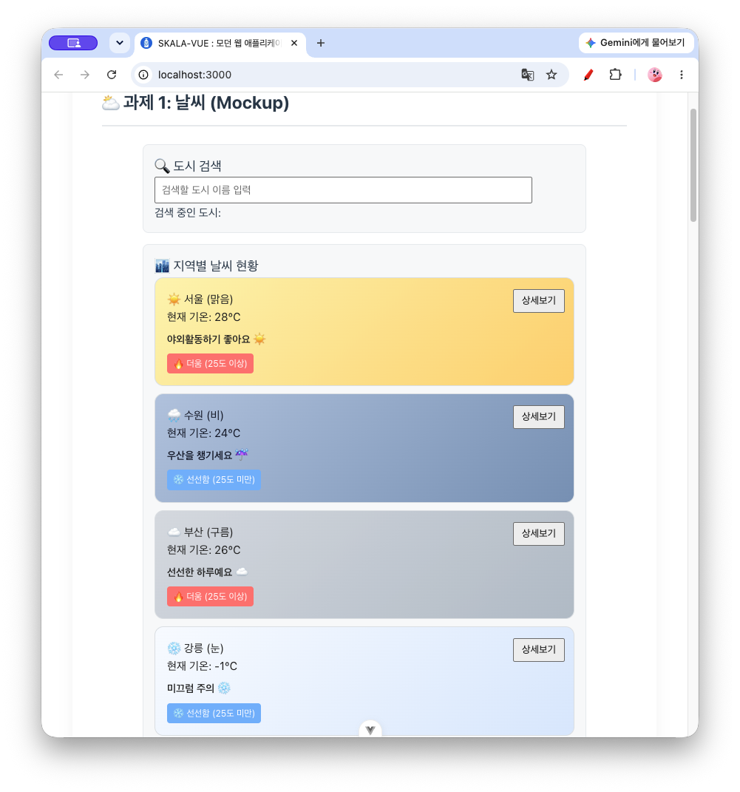

<br />

***

파일명 : WeatherMockup.vue

### 1. 카드 클릭 시 상태바 메세지 변경

지역별 날씨 현황 카드를 클릭하면 상태바 메세지가 변경되도록 구현하였다.

기존 상태바 : '카드를 클릭하거나 검색해 보세요.'

event : 지역별 날씨 현황 카드 클릭

변경 상태바 : “{도시}이 선택되었습니다."

<br />

```
<div v-for="item in weatherList" :key="item.id" class="weather-card" @click="selectedCityInfo = `${item.name}이 선택되었습니다.`">
```

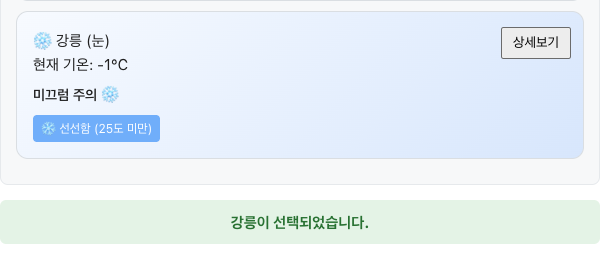

<br />

<br />

### 2. 날씨 상태별 아이콘 및 Theme 추가

날씨 상태를 직관적으로 구분할 수 있도록 각 데이터에 `icon`, `theme` 속성을 추가하였다.

* 맑음 → ☀️ + background\_color: 밝은 노랑 배경

* 비 →  🌧️ + background\_color: 푸른 회색 배경

* 눈 → ❄️ + background\_color: 밝은 하늘\~흰 배경&#x20;

* 구름 → ☁️ + background\_color:회청색 배경

<br />

```
const weatherList = ref([
  { id: 'city_01', name: '서울', temp: 28, status: '맑음', icon: '☀️', theme: 'sunny' },
  { id: 'city_02', name: '수원', temp: 24, status: '비', icon: '🌧️', theme: 'rainy' },
  { id: 'city_03', name: '부산', temp: 26, status: '구름', icon: '☁️', theme: 'cloudy' },
  { id: 'city_04', name: '강릉', temp: -1, status: '눈', icon: '❄️', theme: 'snowy' },
])
```

Template에서는 `:class`를 이용해 날씨별 Theme을 동적으로 적용하였다.

```
<div v-for="item in weatherList" :key="item.id" class="weather-card" :class="item.theme">
  <h4>{{ item.icon }} {{ item.name }} ({{ item.status }})</h4>
</div>
```

***

파일명 : exercise.css

### 3. 날씨별 카드 배경 디자인 추가

날씨 상태에 따라 카드의 배경색을 다르게 적용하여 실제 날씨 애플리케이션과 유사한 Mockup을 구현하였다.

<br />

```
# 파일명 : exercise.css
.weather-card.sunny { background: linear-gradient(135deg, #fff4b1, #ffd36e); }
.weather-card.rainy { background: linear-gradient(135deg, #b7c9e2, #7f9bbd); }
.weather-card.cloudy { background: linear-gradient(135deg, #d9dde3, #b8c2cc); }
.weather-card.snowy { background: linear-gradient(135deg, #f8fbff, #dbeafe); }
```

### 4. 날씨 상태별 안내 문구 추가

날씨 상태에 따라 사용자에게 서로 다른 안내 메시지가 출력되도록 구현하였다.

```
# 파일명 : WeatherMockup.vue
const weatherMessages = {
  맑음: '야외활동하기 좋아요 ☀️',
  비: '우산을 챙기세요 ☔',
  눈: '미끄럼 주의 ❄️',
  구름: '선선한 하루예요 ☁️',
}
```

```
<p class="weather-message">{{ weatherMessages[item.status] }}</p>
```

<br />

`v-for`를 사용하므로 별도의 HTML 코드를 작성하지 않아도 데이터 추가만으로 새로운 카드가 자동 렌더링된다.

***

파일명 : WeatherMockup.vue

### 5. 상세보기 버튼 버그 수정 및 버블링 방지

`상세보기` 버튼 클릭 시에는 도시 ID를 기준으로 `weatherList`를 조회하여 이름과 날씨 상태를 `window.alert`로 출력하도록 구현하였다.

(버그 수정)

`상세보기` 버튼 클릭 시 `window.alert`가 뜨지 않던 문제를 수정하였다. 기존에는 버튼이 `item.name`, `item.status`를 인자로 넘기는데 함수는 `cityId` 하나만 받아 처리하였고, `weatherList`(ref)를 `.value` 없이 인덱싱하여 `undefined` 참조 에러가 발생, 이로 인해 `alert` 실행 전에 예외가 발생해 아무 메세지도 뜨지 않았다.

`item.id`를 전달하여 `weatherList.value`에서 `find`로 해당 도시를 조회하도록 수정하였다.

```
# 파일명 : WeatherMockup.vue
<button class="btn-detail" @click.stop="showDetail(item.id)">상세보기</button>
```

```
const showDetail = (cityId) => {
  const detail = weatherList.value.find((item) => item.id === cityId)
  if (!detail) return

  window.alert(`${detail.name}의 현재 날씨는 [${detail.status}] 상태입니다.`)
}
```

카드 클릭 시 상태바 메세지 변경 이벤트와 `상세보기` 버튼 클릭 이벤트가 겹치지 않도록 버튼에는 `@click.stop`을 적용, 버튼 클릭이 카드 클릭 이벤트로 버블링되지 않도록 하였다.

```
<div v-for="item in weatherList" :key="item.id" class="weather-card" :class="item.theme" @click="selectedCityInfo = `${item.name}이 선택되었습니다.`">
```

<br />

!\[image]\(./image/alert-수원의 현재날씨는 비상태입니다.png)

<br />

<br />

### 6. 도시 검색 필터링 기능 추가

검색창에 입력한 값이 화면에 표시만 되고 실제 목록에는 반영되지 않던 문제를 수정하였다. `computed`로 `searchQuery`에 포함된 이름을 가진 도시만 걸러내는 `filteredWeatherList`를 추가하고, 카드 목록의 `v-for` 대상을 기존 `weatherList`에서 `filteredWeatherList`로 변경하였다.

```
# 파일명 : WeatherMockup.vue
import { ref, computed } from 'vue'

const filteredWeatherList = computed(() =>
  weatherList.value.filter((item) => item.name.includes(searchQuery.value)),
)
```

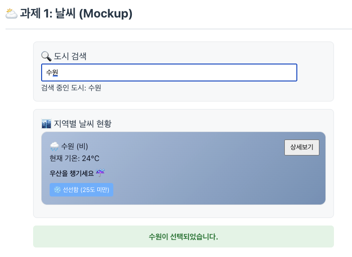

***

<a id="part-3"></a>

# 3. Hands on - Weather Composition (Composition API)

<br />

파일명 : WeatherComposition.vue

## 과제 3 : 날씨 (Composition API)

기존 Weather Mockup(`WeatherMockup.vue`)에 Composition API의 `computed`, `watch`, `watchEffect`를 추가하여 검색 필터링과 상태 변화 감시 기능을 확장하였다.

<br />

#### 개요

```
weatherList
   │
   ├─ computed → 검색 결과 필터링
   │
   ├─ v-for → 필터링된 카드 출력
   │
   ├─ v-if → 온도에 따른 라벨
   │
   └─ @click → 선택 도시 변경
                     │
                     ▼
                   watch
                     │
                     ▼
                Console Log

searchQuery
   │
   ├─ @input → 검색어 변경
   ├─ computed → 검색 결과 재계산
   └─ watchEffect → 검색어 변경 자동 감지
```

<br />

#### 전체 이미지

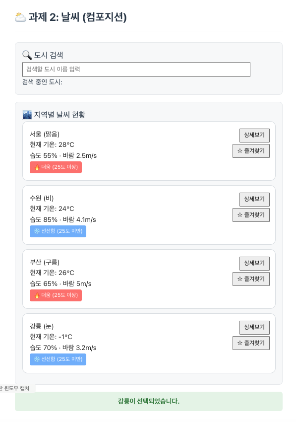

<br />

***

### 1. 반응형 상태 관리

1일차와 동일하게 검색어(`searchQuery`), 선택된 도시 안내 문구(`selectedCityInfo`), 지역별 날씨 데이터(`weatherList`)를 `ref`로 정의하였다.

```
const weatherList = ref([
  { id: 'city_01', name: '서울', temp: 28, status: '맑음', icon: '☀️', theme: 'sunny', humidity: 55, wind: 2.5 },
  { id: 'city_02', name: '수원', temp: 24, status: '비', icon: '🌧️', theme: 'rainy', humidity: 85, wind: 4.1 },
  { id: 'city_03', name: '부산', temp: 26, status: '구름', icon: '☁️', theme: 'cloudy', humidity: 65, wind: 5.0 },
  { id: 'city_04', name: '강릉', temp: -1, status: '눈', icon: '❄️', theme: 'snowy', humidity: 70, wind: 3.2 },
])

const searchQuery = ref('')
const selectedCityInfo = ref('카드를 클릭하거나 검색해 보세요.')
```

**버그 수정** : 원래 데이터에는 `humidity`(습도), `wind`(풍속) 필드가 없는데 템플릿에서 `item.humidity`, `item.wind`를 그대로 출력하고 있어 화면에 `undefined`가 찍히던 문제가 있었다. 각 도시 데이터에 습도/풍속 값을 추가하여 해결하였다.

<br />

### 2. 검색 필터링 (computed)

전체 `weatherList` 중 `searchQuery`가 도시 이름에 포함된 항목만 걸러 `filteredWeatherList`에 담는다. 검색어가 비어 있으면 원본 배열을 그대로 반환한다.

```
const filteredWeatherList = computed(() => {
  const query = searchQuery.value.trim()
  if (!query) {
    return weatherList.value
  }
  return weatherList.value.filter((item) => item.name.includes(query))
})
```

<br />

### 3. 검색 결과 표시 (Template)

* 검색어가 비어 있을 때 : `filteredWeatherList`가 `weatherList` 전체를 그대로 반환하므로 원본 데이터가 출력된다.

* 검색어와 일치하는 데이터가 있을 때 : 일치하는 카드만 `v-for`로 렌더링된다.

* 검색어와 일치하는 데이터가 없을 때 : 안내 문구를 출력한다.

```
<div v-for="item in filteredWeatherList" :key="item.id" class="weather-card" @click="selectedCityInfo = `${item.name}이 선택되었습니다.`">
  ...
</div>

<p v-if="filteredWeatherList.length === 0" style="text-align: center; color: #e74c3c; padding: 10px 0">
  😭 검색 결과와 일치하는 도시가 없습니다.
</p>
```

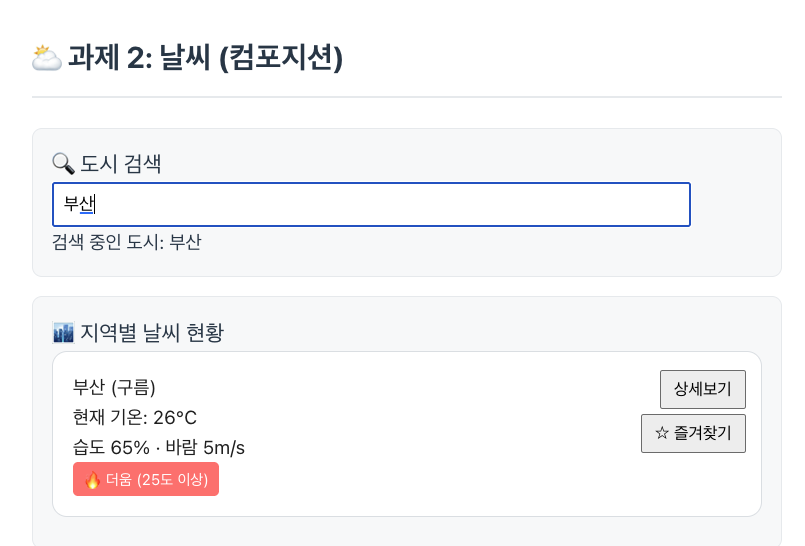

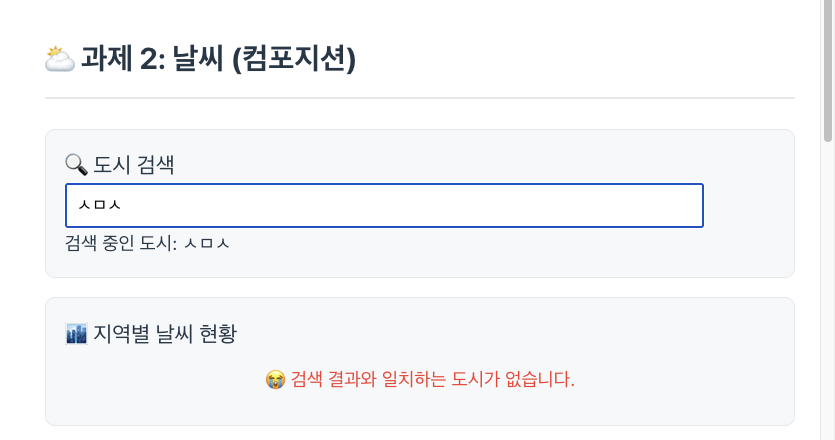

<br />

### 4. 반응형 변수 변화 감시 (watch, watchEffect)

* `selectedCityInfo` 감시 (`watch`) : 카드 클릭 등으로 상태바 문구가 바뀔 때마다 콘솔로그를 남긴다.

* `searchQuery` 감시 (`watchEffect`) : 검색어를 타이핑할 때마다 자동으로 추적되어 콘솔로그를 남긴다.

```
watch(selectedCityInfo, (newInfo) => {  console.log(`👁️‍🗨️ [watch 감지] 상태 바 문구가 업데이트되었습니다 -> "${newInfo}"`)
})

watchEffect(() => {
  console.log(`🤖 [watchEffect 자동 호출] 현재 검색어 '${searchQuery.value}'에 매칭되는 API 데이터를 필터링합니다.`)
}
```

<br />

<br />

<br />

### 5. 본인만의 반응형 상태 / Computed / Watcher : **"☆ 즐겨찾기 도시"**

카드마다 "☆ 즐겨찾기" 버튼을 추가하여 원하는 도시를 즐겨찾기로 지정/해제할 수 있도록 구현하였다.

* 반응형 상태 : 즐겨찾기로 지정된 도시 이름을 담는 `favoriteCity`

* Computed : `favoriteCity`에 해당하는 도시의 상세 정보를 `weatherList`에서 조회하는 `favoriteCityDetail`

* Watcher : `favoriteCity`가 바뀔 때마다(지정/해제) 콘솔로그를 남기는 `watch`

```
const favoriteCity = ref(null)

const toggleFavorite = (cityName) => {
  favoriteCity.value = favoriteCity.value === cityName ? null : cityName
}

const favoriteCityDetail = computed(() => weatherList.value.find((item) => item.name === favoriteCity.value) ?? null)

watch(favoriteCity, (newCity, oldCity) => {
  if (newCity) {
    console.log(`⭐ [watch 감지] 즐겨찾기 도시가 "${oldCity ?? '없음'}" -> "${newCity}"(으)로 변경되었습니다.`)
  } else {
    console.log(`⭐ [watch 감지] "${oldCity}" 즐겨찾기가 해제되었습니다.`)
  }
})
```

Template에는 카드별 토글 버튼과, 즐겨찾기 지정 시 상세 정보를 보여주는 안내 줄을 추가하였다.

```
<button class="btn-favorite" @click.stop="toggleFavorite(item.name)">
  {{ favoriteCity === item.name ? '⭐ 즐겨찾기 해제' : '☆ 즐겨찾기' }}
</button>

<p v-if="favoriteCityDetail">⭐ 즐겨찾기: {{ favoriteCityDetail.name }} ({{ favoriteCityDetail.temp }}°C, {{ favoriteCityDetail.status }})</p>
```

**버그 수정 (CSS)** : 기존 `exercise.css`의 `.btn-detail`은 카드 안에서 `position: absolute; right: 12px; top: 15px;`로 고정 배치되어 있는데, 즐겨찾기 버튼도 같은 클래스를 그대로 쓰면 상세보기 버튼과 정확히 같은 자리에 겹쳐 렌더링되어 상세보기 버튼 클릭이 막히는 문제가 있었다. `.btn-favorite` 클래스를 새로 추가해 `top` 위치를 아래로 분리하여 해결하였다.

```
.btn-favorite {
  position: absolute;
  right: 12px;
  top: 50px;
  padding: 6px 10px;
  cursor: pointer;
}
```

<br />

\[사진] 즐겨찾기 : 부산

&#x20;"즐겨찾기" 버튼을 추가하여 원하는 도시를 즐겨찾기로 지정/해제할 수 있도록 구현하였다

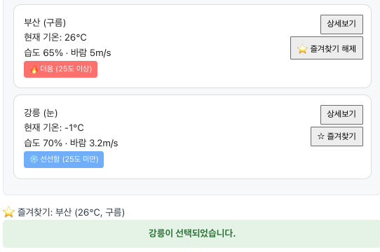

<br />

\[사진] "즐겨찾기" 도시를 변경할 때 마다 console.log를 통해 확인할 수 있다.

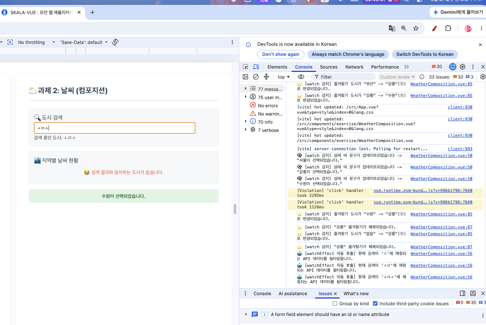

<br />

### 동작 검증

`WeatherComposition` 에서 다음을 확인하였습니다.

* 검색어 `'부산'` 입력 → 부산 카드만 남음

* 존재하지 않는 검색어(`'ㅅㅁㅅ'`) 입력 → "검색 결과와 일치하는 도시가 없습니다" 안내 노출, 카드 0개

* 검색어를 비움 → 카드 4개 전체 복원

* 카드 클릭 → 상태바가 "{도시}이 선택되었습니다."로 변경, 콘솔에 `watch` 로그 출력

* `상세보기` 버튼 클릭 → `window.alert` 노출, 카드 클릭 이벤트로 버블링되지 않아 상태바는 그대로 유지

* `즐겨찾기` 버튼 클릭 → 버튼 문구 토글 및 즐겨찾기 안내 줄 표시/숨김 정상 동작, 콘솔에 `watch` 로그 출력

* 검색어 변경 시마다 `watchEffect` 로그가 매번 출력됨

<br />

<br />

***

<a id="part-4"></a>

# 4. Hands on - Weather Component (컴포넌트 분리)

<br />

파일명 : WeatherParent.vue, BaseDashboardCard.vue, SearchBar.vue, WeatherCard.vue, FavoriteButton.vue

## 과제 4 : 날씨 (컴포넌트 분리)

기능 변경 없이 하나의 파일(`WeatherComposition.vue`)로 되어 있던 대시보드를 4개(+1) 컴포넌트로 분리하였다. Props/Emits 흐름은 다음과 같다.

```
WeatherParent (반응형 상태 전부 보유)
├─ BaseDashboardCard (검색 박스) ── slot ──> SearchBar
├─ BaseDashboardCard (리스트 박스) ── slot ──> WeatherCard (v-for)
│                                              └─ FavoriteButton
└─ status-bar
```

***

### 1. WeatherParent.vue — 반응형 상태 유지

`weatherList`, `searchQuery`, `selectedCityInfo`와 이를 기반으로 한 `filteredWeatherList`(computed), `watch`/`watchEffect`, `showDetail` 로직을 그대로 부모 컴포넌트에 유지하였다. 자식 컴포넌트는 상태를 소유하지 않고 props/emit으로만 상태에 접근한다.

```
const weatherList = ref([
  { id: 'city_01', name: '서울', temp: 28, status: '맑음' },
  { id: 'city_02', name: '수원', temp: 24, status: '비' },
  { id: 'city_03', name: '부산', temp: 26, status: '구름' },
])

const searchQuery = ref('')
const selectedCityInfo = ref('카드를 클릭하거나 검색해 보세요.')

const filteredWeatherList = computed(() => {
  const query = searchQuery.value.trim()
  if (!query) return weatherList.value
  return weatherList.value.filter((item) => item.name.includes(query))
})

watch(selectedCityInfo, (newInfo) => {
  console.log(`👁️‍🗨️ [watch 감지] 상태 바 문구가 업데이트되었습니다 -> "${newInfo}"`)
})

watchEffect(() => {
  console.log(`🤖 [watchEffect 자동 호출] 현재 검색어 '${searchQuery.value}'에 매칭되는 API 데이터를 필터링합니다.`)
})
```

<br />

### 2. BaseDashboardCard.vue — 공통 카드 레이아웃 + slot

검색 박스와 리스트 박스가 공유하는 카드 디자인(배경, 여백, 테두리)을 하나의 컴포넌트로 공통화하고, 내부는 `<slot>`으로 비워 부모가 원하는 내용(도시 검색 UI 또는 날씨 현황 목록)을 주입하도록 하였다.

```
<template>
  <div class="base-dashboard-card">
    <slot></slot>
  </div>
</template>

<style scoped>
.base-dashboard-card {
  background: #f8f9fa;
  padding: 15px;
  border-radius: 8px;
  margin-bottom: 15px;
  border: 1px solid #e9ecef;
}
</style>
```

```
<BaseDashboardCard>
  <SearchBar :current-query="searchQuery" @update-query="(val) => (searchQuery = val)" />
</BaseDashboardCard>

<BaseDashboardCard>
  <h3>🏙️ 지역별 날씨 현황</h3>
  <WeatherCard v-for="item in filteredWeatherList" :key="item.id" ... />
</BaseDashboardCard>
```

<br />

### 3. SearchBar.vue — props로 검색어 수신, emit으로 검색어 전달

부모의 `searchQuery`를 `currentQuery` props로 받아 화면에 표시하고, 입력이 발생하면 `update-query` 이벤트로 새 검색어 값을 부모에게 올려보낸다(부모가 실제 `ref`를 갱신).

```
defineProps({
  currentQuery: { type: String, default: '' },
})
defineEmits(['update-query'])
```

```
<input type="text" :value="currentQuery" @input="$emit('update-query', $event.target.value)" placeholder="검색할 도시 이름 입력" />
```

**보완** : 기존에는 `<style scoped>`가 아예 없어 입력창 스타일을 전역 `exercise.css`에만 의존하고 있었다. 요구사항 5·6(컴포넌트별 디자인은 `<style scoped>`로 분리)에 맞춰 입력창 스타일을 컴포넌트 자체 스코프 스타일로 옮겼다.

```
<style scoped>
.search-inner input {
  padding: 8px;
  width: 90%;
  font-size: 14px;
}
</style>
```

<br />

### 4. WeatherCard.vue — props로 도시 정보 수신, emit으로 카드 선택/상세보기 전달

선택된 도시 객체(`cityItem`)를 props로 받아 표시하고, 카드 클릭은 `select-card`, 상세보기 버튼 클릭은 `click-detail` 이벤트로 부모에게 전달한다. 상세보기 버튼은 `@click.stop`으로 카드 클릭 이벤트로의 버블링을 막는다.

```
defineProps({
  cityItem: { type: Object, required: true },
})
const emit = defineEmits(['select-card', 'click-detail'])
```

```
<div class="weather-card" @click="emit('select-card', `${cityItem.name}이 선택되었습니다.`)">
  ...
  <button class="btn-detail" @click.stop="emit('click-detail', cityItem.name, cityItem.status)">상세보기</button>
</div>
```

<br />

### 참고 : Slot과 스코프의 관계

`SearchBar`, `WeatherCard`는 시각적으로는 `BaseDashboardCard`의 `<slot>` 안에 위치하지만, 실제로 이 태그들은 `WeatherParent.vue`의 `<template>`에 작성되어 있으므로 스크립트 상으로는 `WeatherParent`의 스코프에서 컴파일·평가된다. 그래서 `WeatherParent`는 `BaseDashboardCard`를 거치지 않고도 `SearchBar`/`WeatherCard`에 직접 props를 내려주고 emit을 직접 수신할 수 있다.

```
<BaseDashboardCard>
  <SearchBar :current-query="searchQuery" @update-query="..." />
</BaseDashboardCard>
```

<br />

### 5·6. 컴포넌트별 `<style scoped>` 분리

기존 `exercise.css`에 뭉쳐 있던 스타일을 각 컴포넌트가 실제로 사용하는 부분만 나누어 자기 자신의 `<style scoped>`로 이동하였다.

| 컴포넌트                    | scoped 스타일                                                |
| ----------------------- | --------------------------------------------------------- |
| `BaseDashboardCard.vue` | `.base-dashboard-card` (검색/리스트 박스 공통 배경)                  |
| `WeatherCard.vue`       | `.weather-card`, `.badge`, `.hot`, `.cool`, `.btn-detail` |
| `SearchBar.vue`         | `.search-inner input`                                     |
| `FavoriteButton.vue`    | `.btn-favorite`                                           |
| `WeatherParent.vue`     | `.dashboard-wrapper`, `.status-bar`                       |

**보완** : `WeatherParent.vue`도 `.status-bar`를 자체 스타일로 갖고 있지 않고 전역 CSS에만 의존하고 있어서, 자신의 템플릿에서 직접 사용하는 `.status-bar`를 `<style scoped>`에 추가하였다.

<br />

### 7. 추가 컴포넌트 분리 : FavoriteButton.vue

1일차~2일차(Mockup, Composition) 과제에서 직접 추가했던 "즐겨찾기" 기능을 이번엔 `WeatherCard.vue`에서 한 번 더 분리하여 `FavoriteButton.vue`라는 독립 컴포넌트로 만들었다. 즐겨찾기 상태(`favoriteCity`)는 여러 카드가 공유해야 하므로 요구사항 1에 따라 `WeatherParent.vue`가 계속 소유하고, `WeatherCard`는 `isFavorite` props만 받아 `FavoriteButton`에 그대로 넘겨주고 `toggle-favorite` 이벤트를 다시 부모로 올려보내는 중계 역할만 한다.

```
# 파일명 : FavoriteButton.vue
defineProps({ isFavorite: { type: Boolean, default: false } })
const emit = defineEmits(['toggle'])
```

```
<button class="btn-favorite" @click.stop="emit('toggle')">
  {{ isFavorite ? '⭐ 즐겨찾기 해제' : '☆ 즐겨찾기' }}
</button>
```

```
# 파일명 : WeatherCard.vue
<FavoriteButton :is-favorite="isFavorite" @toggle="emit('toggle-favorite', cityItem.name)" />
```

```
# 파일명 : WeatherParent.vue
const favoriteCity = ref(null)

const toggleFavorite = (cityName) => {
  favoriteCity.value = favoriteCity.value === cityName ? null : cityName
}

const favoriteCityDetail = computed(() => weatherList.value.find((item) => item.name === favoriteCity.value) ?? null)

watch(favoriteCity, (newCity, oldCity) => {
  if (newCity) {
    console.log(`⭐ [watch 감지] 즐겨찾기 도시가 "${oldCity ?? '없음'}" -> "${newCity}"(으)로 변경되었습니다.`)
  } else {
    console.log(`⭐ [watch 감지] "${oldCity}" 즐겨찾기가 해제되었습니다.`)
  }
})
```

```
<WeatherCard
  v-for="item in filteredWeatherList"
  :key="item.id"
  :city-item="item"
  :is-favorite="favoriteCity === item.name"
  @select-card="(msg) => (selectedCityInfo = msg)"
  @click-detail="showDetail"
  @toggle-favorite="toggleFavorite"
/>

<p v-if="favoriteCityDetail">⭐ 즐겨찾기: {{ favoriteCityDetail.name }} ({{ favoriteCityDetail.temp }}°C, {{ favoriteCityDetail.status }})</p>
```

<br />

### 동작 검증

Playwright로 dev 서버(`WeatherParent` 섹션)를 직접 구동하여 다음을 확인하였다.

* 검색어 `'서울'` 입력 → 서울 카드만 남음

* 존재하지 않는 검색어(`'zzz'`) 입력 → "검색 결과와 일치하는 도시가 없습니다" 안내 노출, 카드 0개

* 검색어를 비움 → 카드 3개 전체 복원

* 카드 클릭 → `select-card` 이벤트로 상태바가 "{도시}이 선택되었습니다."로 변경, 콘솔에 `watch` 로그 출력

* `상세보기` 버튼 클릭 → `click-detail` 이벤트로 `window.alert` 노출, `@click.stop` 덕분에 카드 클릭(`select-card`) 이벤트로 버블링되지 않아 상태바는 그대로 유지

* `즐겨찾기` 버튼 클릭 → `FavoriteButton` → `WeatherCard` → `WeatherParent`로 `toggle-favorite` 이벤트가 정상 전달되어 버튼 문구 토글 및 즐겨찾기 안내 줄 표시/숨김 정상 동작, 콘솔에 `watch` 로그 출력

* 검색어 변경 시마다 `watchEffect` 로그가 매번 출력됨

***

<a id="part-5"></a>

# 5. Hands on - Weather Router (Vue Router)

<br />

파일명 : router/index.js, App.vue, WeatherHomeView\.vue, WeatherDetailView\.vue, WeatherAboutView\.vue, WeatherStatsView\.vue, NotFoundView\.vue

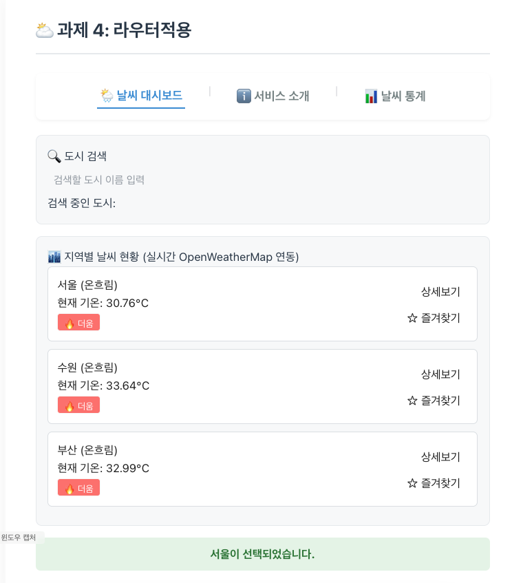

## 과제 4 : 날씨 (Vue Router)

날씨 대시보드를 SPA 라우팅 구조로 전환하였다. `views/` 폴더에 페이지 단위 컴포넌트를 두고, `components/exercise/`의 부품(`BaseDashboardCard`, `SearchBar`, `WeatherCard`)을 그대로 재사용한다.

```
src/
├── main.js            (.use(router))
├── App.vue            (RouterLink 내비게이션 + RouterView)
├── router/index.js    (routes 정의 + Lazy Loading + Catch-all)
├── components/exercise/
│   ├── BaseDashboardCard.vue
│   ├── SearchBar.vue
│   └── WeatherCard.vue
└── views/
    ├── WeatherHomeView.vue
    ├── WeatherAboutView.vue
    ├── WeatherDetailView.vue
    ├── WeatherStatsView.vue   (본인 추가 view)
    └── NotFoundView.vue
```

***

### 버그 수정 : router/index.js가 실제 화면과 연결되어 있지 않던 문제

`views/WeatherHomeView.vue` 등은 이미 작성되어 있었지만, `src/router/index.js`는 여전히 `create-vue` 기본 스캐폴딩 그대로 `HomeView`/`AboutView`만 등록되어 있어서 실제로는 날씨 라우트가 하나도 연결되지 않은 상태였다. 라우트 테이블을 전부 새로 작성하였다.

```
# 파일명 : router/index.js
import { createRouter, createWebHistory } from 'vue-router'
import WeatherHomeView from '../views/WeatherHomeView.vue'

const routes = [
  {
    path: '/',
    name: 'WeatherHome',
    component: WeatherHomeView,
  },
  {
    path: '/about',
    name: 'WeatherAbout',
    component: () => import('../views/WeatherAboutView.vue'),
  },
  {
    path: '/weather/:cityId',
    name: 'WeatherDetail',
    component: () => import('../views/WeatherDetailView.vue'),
  },
  {
    path: '/stats',
    name: 'WeatherStats',
    component: () => import('../views/WeatherStatsView.vue'),
  },
  {
    path: '/:pathMatch(.*)*',
    name: 'NotFound',
    component: () => import('../views/NotFoundView.vue'),
  },
]

const router = createRouter({
  history: createWebHistory(import.meta.env.BASE_URL),
  routes,
})

export default router
```

<br />

### 1. 라우터 설정 : Lazy Loading + Catch-all Route

메인 화면(`WeatherHomeView`)만 정적 import로 즉시 로드하고, 나머지(`/about`, `/weather/:cityId`, `/stats`, catch-all)는 `() => import(...)` 동적 import로 지연 로딩되도록 설정하였다. 빌드 결과에서도 각각 별도 청크로 분리되는 것을 확인하였다.

```
dist/assets/WeatherStatsView-*.js
dist/assets/WeatherDetailView-*.js
dist/assets/WeatherAboutView-*.js
dist/assets/NotFoundView-*.js
```

정의되지 않은 모든 경로는 `path: '/:pathMatch(.*)*'` Catch-all Route로 받아 `NotFoundView`를 보여준다.

<br />

### 2. App.vue : Navigation Bar + RouterView

`RouterLink`로 내비게이션 바를, `RouterView`로 메인 콘텐츠 영역을 배치하였다(기존에 구현되어 있던 부분). 본인 추가 view(`/stats`)를 위한 링크를 내비게이션 바에 추가하였다.

```
<nav class="navigation-bar">
  <RouterLink to="/" class="nav-item">🌦️ 날씨 대시보드</RouterLink>
  <span class="divider">|</span>
  <RouterLink to="/about" class="nav-item">ℹ️ 서비스 소개</RouterLink>
  <span class="divider">|</span>
  <RouterLink to="/stats" class="nav-item">📊 날씨 통계</RouterLink>
</nav>
<main>
  <RouterView />
</main>
```

<br />

### 3. WeatherHomeView\.vue : WeatherParent 대체 + Programmatic Navigation

기존 `WeatherParent.vue`와 동일한 구조(`BaseDashboardCard` + `SearchBar` + `WeatherCard` 조립)로 `/` 경로 화면을 구성하되, 상세보기 클릭 처리 방식만 다르다. `WeatherCard`가 올리는 `click-detail` 이벤트를 받으면 더 이상 `window.alert`를 띄우지 않고, `router.push`로 `/weather/:cityId` 페이지로 이동한다.

```
const handleDetailJump = (id) => {
  router.push(`/weather/${id}`)
}
```

```
<WeatherCard
  v-for="item in filteredWeatherList"
  :key="item.id"
  :city-item="item"
  @select-card="(msg) => (selectedCityInfo = msg)"
  @click-detail="handleDetailJump(item.id)"
/>
```

<br />

### 4. WeatherDetailView\.vue : 동적 경로 매칭 + Mock Data 조회

주소창의 `:cityId`(예: `/weather/city_01`)를 `route.params.cityId`로 받아, 컴포넌트 Mount 시점(`onMounted`)에 로컬 Mock 데이터(`mockDetails`)에서 해당 도시 객체를 찾아 `cityData`에 담는다. 습도·풍속 등 홈 화면에는 없는 상세 정보까지 보여준다.

```
const mockDetails = {
  city_01: { name: '대한민국 서울특별시', temp: 28, status: '맑음', humidity: '55%', wind: '2.5m/s', icon: '☀️' },
  city_02: { name: '경기도 수원시 영통구', temp: 24, status: '비', humidity: '85%', wind: '4.1m/s', icon: '🌧️' },
  city_03: { name: '부산광역시 해운대구', temp: 26, status: '구름', humidity: '65%', wind: '5.0m/s', icon: '☁️' },
}
const cityData = ref(null)

onMounted(() => {
  const id = route.params.cityId
  if (mockDetails[id]) {
    cityData.value = mockDetails[id]
  }
})
```

<br />

### 5. WeatherAboutView\.vue : 서비스 소개 + 메인으로 돌아가기

서비스 소개 문구와 함께, 클릭 시 `router.push('/')`로 메인 대시보드로 돌아가는 버튼을 배치하였다.

```
const handleGoHome = () => {
  router.push('/')
}
```

<br />

### 6. 본인 추가 View : WeatherStatsView\.vue (`/stats`)

지정된 4개 View 외에 직접 추가한 페이지로, 평균 기온과 최고/최저 기온 도시를 계산해 보여주는 통계 화면이다. 아직 전역 스토어(Pinia)가 도입되기 전 단계라, `WeatherHomeView`와 동일한 Mock 데이터를 이 화면 전용으로 별도 선언해 `computed`로 통계를 산출한다.

```
const weatherList = ref([
  { id: 'city_01', name: '서울', temp: 28, status: '맑음' },
  { id: 'city_02', name: '수원', temp: 24, status: '비' },
  { id: 'city_03', name: '부산', temp: 26, status: '구름' },
])

const averageTemp = computed(() => {
  const total = weatherList.value.reduce((sum, item) => sum + item.temp, 0)
  return (total / weatherList.value.length).toFixed(1)
})

const hottestCity = computed(() => weatherList.value.reduce((max, item) => (item.temp > max.temp ? item : max)))
const coldestCity = computed(() => weatherList.value.reduce((min, item) => (item.temp < min.temp ? item : min)))
```

`/stats` 경로로 라우팅하고 `App.vue` 내비게이션 바에 "📊 날씨 통계" 링크를 추가하였다.

<br />

### 동작 검증

Playwright로 dev 서버(`과제 4: 라우터적용` 섹션)를 직접 구동하여 다음을 확인하였다.

* 홈(`/`)에서 카드 3개(서울/수원/부산) 정상 렌더링

* 서울 카드의 `상세보기` 클릭 → `window.alert` 없이 URL이 `/weather/city_01`로 이동, 상세 페이지에 "대한민국 서울특별시 / 28°C / 맑음 / 습도 55% / 풍속 2.5m/s" 표시

* 상세 페이지의 "메인 대시보드로 돌아가기" 클릭 → `/`로 복귀

* 내비게이션의 "서비스 소개" 클릭 → `/about`로 이동, 소개 문구 정상 표시

* 내비게이션의 "날씨 통계" 클릭 → `/stats`로 이동, "평균 기온: 26.0°C / 가장 더운 도시: 서울(28°C) / 가장 추운 도시: 수원(24°C)" 정상 표시

* 존재하지 않는 경로(`/no-such-page`) 직접 접근 → Catch-all Route에 의해 `NotFoundView`("페이지를 찾을 수 없습니다") 렌더링

* `npx vite build` 결과, `/about`·`/weather/:cityId`·`/stats`·catch-all이 각각 별도 JS 청크로 분리되어 Lazy Loading이 적용됨을 확인

***

<a id="part-6"></a>

# 6. Hands on - Weather Store (Pinia)

<br />

파일명 : stores/configStore.js, stores/favoriteStore.js, UnitToggler.vue, WeatherCard.vue, WeatherDetailView\.vue, WeatherHomeView\.vue

## 과제 5 : 날씨 단위 (섭씨/화씨) (Pinia Store 적용)

날씨 단위(섭씨/화씨)를 전역 상태로 관리하는 `configStore`를 도입하고, 메인/상세 화면의 온도 표시에 실제로 반영하였다. 추가로 페이지 이동에도 상태가 유지되는 Store의 장점을 보여주기 위해 즐겨찾기 기능을 `favoriteStore`로 전역화하였다.

<br />

(사진에 기재된 타이틀과 서수(5,6)가 상이한 점 양해부탁드립니다.)

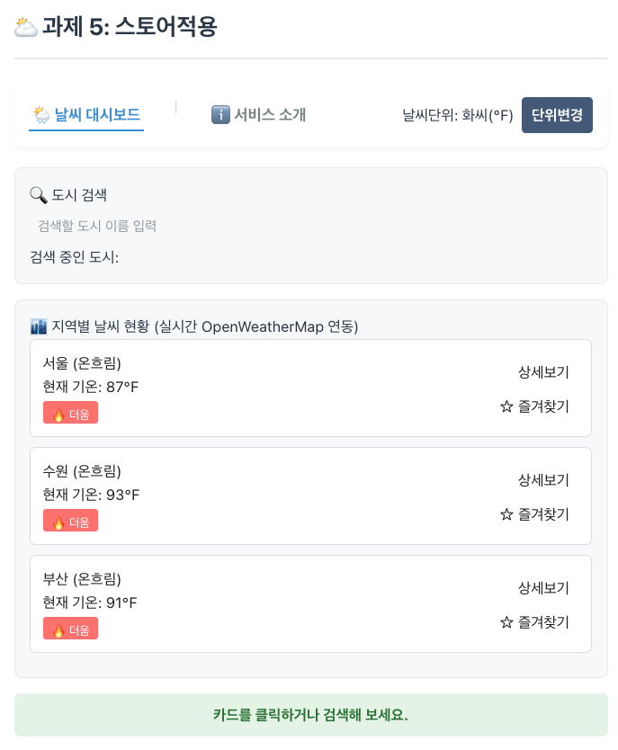

***

### 1. stores/configStore.js — 단위 설정 Store

`setup` 스타일 Pinia 스토어로 state(`unit`), getter(`unitSymbol`), action(`toggleUnit`)을 정의하였다. 이미 작성되어 있던 파일이라 별도 수정 없이 검증만 하였다.

```
export const useConfigStore = defineStore('config', () => {
  const unit = ref('celsius')

  const unitSymbol = computed(() => {
    return unit.value === 'celsius' ? '℃' : '℉'
  })

  function toggleUnit() {
    unit.value = unit.value === 'celsius' ? 'fahrenheit' : 'celsius'
  }

  return { unit, unitSymbol, toggleUnit }
})
```

<br />

### 2. UnitToggler.vue + Navigation Bar 배치

단위 표시와 토글 버튼을 가진 컴포넌트로, 이미 작성되어 `App.vue`의 "과제 5" 내비게이션 바 옆에 배치되어 있었다.

```
<nav class="navigation-bar">
  <RouterLink to="/" class="nav-item">🌦️ 날씨 대시보드</RouterLink>
  <span class="divider">|</span>
  <RouterLink to="/about" class="nav-item">ℹ️ 서비스 소개</RouterLink>
  <UnitToggler />
</nav>
```

<br />

### 3. 메인 · 상세 화면에 단위 변환 적용

**참고용 `.afterStore` 예시 파일의 버그** : 과제 안내에 첨부된 `WeatherCard.vue.afterStore` 예시 코드는 `computed` 안에서 `props.cityItem.temp`를 참조하지만 정작 `const props = defineProps(...)`로 캡처하지 않아(그냥 `defineProps(...)`만 호출) 실행 시 `props`가 정의되지 않아 동작하지 않는 문제가 있었다. 실제 적용 시 이 부분을 고쳐서 반영하였다.

```
# 파일명 : WeatherCard.vue
import { computed } from 'vue'
import { useConfigStore } from '@/stores/configStore'

const props = defineProps({
  cityItem: { type: Object, required: true },
  isFavorite: { type: Boolean, default: false },
})

const configStore = useConfigStore()

const displayTemp = computed(() => {
  const rawTemp = props.cityItem.temp // 기본 원본 데이터는 섭씨 숫자
  if (configStore.unit === 'fahrenheit') {
    return Math.round((rawTemp * 9) / 5 + 32) // 화씨 변환 연산
  }
  return rawTemp // 'celsius'일 때는 원본 그대로 반환
})
```

```
<p>현재 기온: {{ displayTemp }}{{ configStore.unitSymbol }}</p>
```

더움/선선함 배지 판정(`cityItem.temp >= 25`)은 화면 표시 단위와 무관하게 항상 원본 섭씨 값 기준으로 유지하였다(단위를 바꿔도 25도라는 물리적 기준 자체는 변하지 않아야 하므로).

같은 패턴을 상세 페이지에도 적용하였다.

```
# 파일명 : WeatherDetailView.vue
const displayTemp = computed(() => {
  if (!cityData.value) return 0
  const rawTemp = cityData.value.temp
  if (configStore.unit === 'fahrenheit') {
    return Math.round((rawTemp * 9) / 5 + 32)
  }
  return rawTemp
})
```

```
<p>실시간 기온: <strong>{{ displayTemp }}{{ configStore.unitSymbol }}</strong></p>
```

<br />

### 4. (참고, 범위 제외) Composable 리팩터링

`WeatherCard.vue`와 `WeatherDetailView.vue`의 `displayTemp` 로직이 사실상 동일한 코드로 중복된다. 과제 안내대로 이번 범위에서는 `useTempConverter()` 같은 Composable로 추출하지 않고 각 컴포넌트에 그대로 두었다.

<br />

### 5. 본인 추가 Store : favoriteStore.js — 페이지를 넘나드는 즐겨찾기

1\~3일차 과제에서 매번 컴포넌트 로컬 상태(`ref`)로만 구현했던 "즐겨찾기" 기능을 Pinia 스토어로 전역화하였다. 도시 이름 대신 도시 ID(`city_01` 등)를 키로 사용해 홈 화면(짧은 이름 "서울")과 상세 화면(전체 행정명 "대한민국 서울특별시")처럼 표기가 다른 화면 사이에서도 동일 도시를 정확히 식별하도록 하였다.

```
# 파일명 : stores/favoriteStore.js
export const useFavoriteStore = defineStore('favorite', () => {
  const favoriteCity = ref(null)

  function isFavorite(cityId) {
    return favoriteCity.value === cityId
  }

  function toggleFavorite(cityId) {
    favoriteCity.value = favoriteCity.value === cityId ? null : cityId
  }

  return { favoriteCity, isFavorite, toggleFavorite }
})
```

**버그 수정** : `WeatherHomeView.vue`는 `WeatherCard`에 `is-favorite`/`toggle-favorite`를 아예 연결하지 않고 있어서, 홈 화면에서 "☆ 즐겨찾기" 버튼을 눌러도 아무 반응이 없던 문제가 있었다(과제 3의 `WeatherParent.vue`에만 연결되어 있었음). `favoriteStore`로 연결하여 고쳤다.

```
# 파일명 : WeatherHomeView.vue
<WeatherCard
  v-for="item in filteredWeatherList"
  :key="item.id"
  :city-item="item"
  :is-favorite="favoriteStore.isFavorite(item.id)"
  @select-card="(msg) => (selectedCityInfo = msg)"
  @click-detail="handleDetailJump(item.id)"
  @toggle-favorite="favoriteStore.toggleFavorite(item.id)"
/>

<p v-if="favoriteStore.favoriteCity">⭐ 즐겨찾기: {{ weatherList.find((c) => c.id === favoriteStore.favoriteCity)?.name }}</p>
```

상세 페이지에도 같은 스토어로 즐겨찾기 토글 버튼을 추가하여, 홈에서 지정한 즐겨찾기가 상세 페이지로 이동해도(그리고 반대로도) 그대로 유지되는 것을 보여준다.

```
# 파일명 : WeatherDetailView.vue
const isFavorite = computed(() => favoriteStore.isFavorite(route.params.cityId))
```

```
<button class="favorite-btn" @click="favoriteStore.toggleFavorite(route.params.cityId)">
  {{ isFavorite ? '⭐ 즐겨찾기 해제' : '☆ 즐겨찾기 추가' }}
</button>
```

<br />

### 동작 검증

`과제 5: 스토어적용` 에서 다음을 확인하였다.

* 초기 상태 : 서울/수원/부산 카드 기온이 각각 28℃/24℃/26℃로 표시

* 단위변경 버튼 클릭 → 라벨이 "화씨(℉)"로 바뀌고, 카드 기온이 82℉/75℉/79℉로 정확히 변환

* 서울 카드의 즐겨찾기 버튼 클릭 → "⭐ 즐겨찾기: 서울" 안내 줄 노출

* 서울 카드 상세보기 클릭 → `/weather/city_01`로 이동, 단위가 화씨로 유지된 채 "82℉" 표시, 즐겨찾기 버튼도 이미 "⭐ 즐겨찾기 해제" 상태로 표시(홈에서 지정한 즐겨찾기가 스토어를 통해 그대로 반영됨)

* 상세 페이지에서 단위변경 클릭 → 즉시 "28℃"로 재계산되어 표시

* "메인 대시보드로 돌아가기" 클릭 → 홈에서도 단위(섭씨)와 즐겨찾기(서울) 상태가 그대로 유지됨

**참고** : 스크린샷에서 "과제 4"와 "과제 5" 섹션 모두 동일하게 "즐겨찾기: 서울"과 화씨/섭씨 상태가 나타나는데, 이는 버그가 아니라 두 섹션이 같은 `RouterView`/Pinia 스토어 인스턴스를 공유하기 때문에 나타나는 정상적인 현상이다(Pinia 스토어는 컴포넌트 트리 위치와 무관하게 앱 전체에서 단 하나만 존재).

***

<a id="part-7"></a>

# 7. Hands on - Weather Axios (외부 API 연동)

<br />

파일명 : .env, .env.example, .gitignore, WeatherAxios.vue

## 과제 7 : 날씨 (Axios + 외부 API 연동)

Mock 데이터로 채워져 있던 화면을 실제 OpenWeatherMap API 호출로 교체하고, OpenWeatherMap의 다른 API 및 완전히 다른 외부 API를 하나씩 추가로 연동하여 기능을 확장하였다.

<br />

(사진에 기재된 타이틀과 과제 내용이 상이한 점 양해부탁드립니다.)

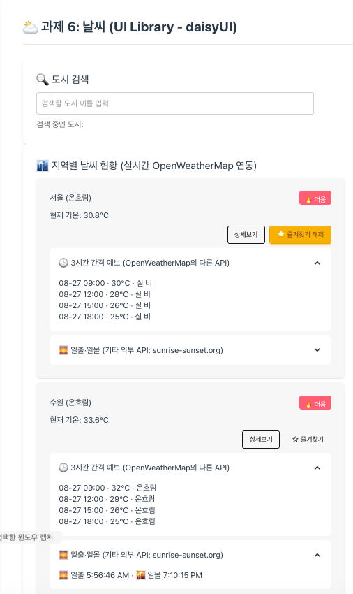

<br />

***

### ⚠️ 보안 이슈 확인 및 조치 : API 키 하드코딩

과제 참고용으로 제공된 `WeatherHomeView.vue.afterAxios`, `WeatherDetailView.vue.afterAxios` 예시 파일에 OpenWeatherMap API 키가 **소스 코드에 평문으로 하드코딩**되어 있었고, 이미 git 커밋 이력(`b982b46`)에 그대로 올라가 있는 상태였다.

```
const API_KEY = 'sk-xxxxxxxxxxxxxxxxxxxxxxxxxxxxxxxx' // ❌ 소스에 그대로 노출 (실제 값은 편의상 예시로 대체)
```

실제 서비스 코드에는 이 패턴을 그대로 옮기지 않고, Vite의 환경변수 방식으로 분리하였다.

* `.env` (git 추적 제외, 로컬 실행/개발용) : `VITE_OPENWEATHER_API_KEY=...` 실제 키 보관

* `.env.example` (git 추적) : 키 이름만 안내하는 템플릿

* `.gitignore`에 `.env`, `.env.*` 규칙 추가 (`.env.example`만 예외로 허용)

```
# 파일명 : .gitignore
.env
.env.*
!.env.example
```

```
# 파일명 : .env.example
VITE_OPENWEATHER_API_KEY=your_openweathermap_api_key_here
```

코드에서는 `import.meta.env.VITE_OPENWEATHER_API_KEY`로만 참조하여, 저장소 어디에도 키 원문이 남지 않도록 하였다.

> **참고** : 위 하드코딩된 키는 이미 git 히스토리에 노출된 상태이므로(과거 커밋을 지워도 완전히 사라지지 않음), OpenWeatherMap 계정에서 해당 키를 재발급받아 `.env`의 값을 교체하는 것을 권장한다.

<br />

### 1. WeatherAxios.vue : 실제 OpenWeatherMap 데이터로 카드 목록 구성

Mock `weatherList` 배열을 제거하고, 컴포넌트 Mount 시점에 서울/수원/부산 3개 도시의 현재 날씨(Current Weather Data API)를 조회하여 채운다. 로딩/에러 상태를 추가해 사용자에게 통신 상태를 보여준다. 6일차(UI Library) 섹션과 같은 화면(3개 도시)을 조회하므로, 공용 캐시 모듈(`src/utils/weatherCache.js`)을 함께 사용해 두 섹션이 동시에 마운트되어도 API 호출이 중복되지 않도록 하였다.

```
import { fetchCachedWeatherList } from '@/utils/weatherCache'

const API_KEY = import.meta.env.VITE_OPENWEATHER_API_KEY

const fetchRealTimeWeather = async () => {
  isLoading.value = true
  loadError.value = ''
  try {
    weatherList.value = await fetchCachedWeatherList(API_KEY)
  } catch (error) {
    console.error('🔴 날씨 API 연동 실패:', error)
    loadError.value = '실시간 날씨 데이터를 불러오지 못했습니다.'
  } finally {
    isLoading.value = false
  }
}

onMounted(fetchRealTimeWeather)
```

더움/선선함 배지 판정(`item.temp >= 25`)은 실제 API가 반환하는 실측 섭씨 값을 그대로 사용한다.

<br />

### 2. 상세보기 펼치기 : 실제 데이터 + OpenWeatherMap의 다른 API 확장

카드의 `상세보기` 버튼을 누르면 카드 안쪽에 상세 패널이 펼쳐지면서, 그 시점에 처음으로 해당 도시의 Current Weather Data API(습도/풍속/좌표)를 조회한다(이미 조회한 도시는 캐시된 결과를 재사용).

이어서 **요구사항 2("OpenWeatherMap에서 제공되는 API를 추가하여 기능 확장")** 로, 같은 도시의 **5 Day / 3 Hour Forecast API**(`/data/2.5/forecast`)를 추가 호출하여 향후 3시간 간격 예보 4개를 패널 안에 함께 표시하였다.

```
const loadDetail = async (id) => {
  if (detailByCity.value[id] || detailLoading.value[id]) return
  detailLoading.value = { ...detailLoading.value, [id]: true }
  try {
    const weatherRes = await axios.get('https://api.openweathermap.org/data/2.5/weather', {
      params: { q: cityEnglishName[id], appid: API_KEY, units: 'metric', lang: 'kr' },
    })
    const raw = weatherRes.data

    const forecastRes = await axios.get('https://api.openweathermap.org/data/2.5/forecast', {
      params: { q: cityEnglishName[id], appid: API_KEY, units: 'metric', lang: 'kr' },
    })
    // ...(습도/풍속/예보 목록을 detailByCity[id]에 저장)
  } finally {
    detailLoading.value = { ...detailLoading.value, [id]: false }
  }
}
```

<br />

### 3. 기타 외부 API 연동 : sunrise-sunset.org (일출·일몰)

**요구사항 3("기타 외부 API를 추가하여 기능 확장")** 으로, OpenWeatherMap과 무관한 별도의 무료 공개 API인 [sunrise-sunset.org](https://sunrise-sunset.org/api)를 연동하였다. 회원가입·API 키가 필요 없고 CORS가 전면 허용되어 있어 브라우저에서 바로 호출 가능하다. 앞서 받아온 도시 좌표(`raw.coord`)를 그대로 넘겨 해당 도시의 일출·일몰 시각을 조회하고, 같은 상세 패널 안에 예보와 함께 표시하였다.

```
const sunRes = await axios.get('https://api.sunrise-sunset.org/json', {
  params: { lat: raw.coord.lat, lng: raw.coord.lon, tzid: 'Asia/Seoul' },
})
```

`tzid=Asia/Seoul` 파라미터 덕분에 별도의 UTC 변환 없이 한국 현지 시각 문자열을 그대로 받을 수 있었다.

<br />

### 2. 요구사항 1 : OpenWeatherMap 실시간 데이터 연동 (추가 API 호출 없음)

Mock 데이터 대신 실제 OpenWeatherMap Current Weather 데이터를 표시하되, 6일차에 만들어 둔 공용 캐시 모듈(`src/utils/weatherCache.js`)을 그대로 재사용하였다. `WeatherHomeView.vue`가 이미 같은 3개 도시(서울/수원/부산)를 같은 캐시로 조회하고 있으므로, 이 컴포넌트가 추가로 마운트되어도 **새 네트워크 호출이 발생하지 않고 캐시를 공유**한다("외부 API 추가 시에, 페이지당 외부 호출이 너무 많아 localhost:3001 접속이 어렵다"는 문제를 겪었던 것을 교훈 삼아 처음부터 반영).

```
import { fetchCachedWeatherList } from '@/utils/weatherCache'

const fetchRealTimeWeather = async () => {
  isLoading.value = true
  try {
    weatherList.value = await fetchCachedWeatherList(API_KEY)
  } catch (error) {
    loadError.value = '실시간 날씨 데이터를 불러오지 못했습니다.'
  } finally {
    isLoading.value = false
  }
}
onMounted(fetchRealTimeWeather)
```

<br />

### 3. 요구사항 2 : OpenWeatherMap의 다른 API 추가 — 5 Day / 3 Hour Forecast

카드를 클릭해서 펼치기 전까지는 호출하지 않는 **온디맨드 방식**으로 예보 API를 추가하였다(자동 호출 총량을 늘리지 않기 위함). daisyUI `collapse`의 체크박스 토글에 `@change`를 걸어 처음 펼칠 때만 호출하고, 이후에는 캐시된 결과를 재사용한다.

```
const loadForecast = async (id) => {
  if (forecastByCity.value[id] || forecastLoading.value[id]) return
  forecastLoading.value = { ...forecastLoading.value, [id]: true }
  try {
    const res = await axios.get('https://api.openweathermap.org/data/2.5/forecast', {
      params: { q: cityEnglishName[id], appid: API_KEY, units: 'metric', lang: 'kr' },
    })
    forecastByCity.value = {
      ...forecastByCity.value,
      [id]: res.data.list.slice(0, 4).map((item) => ({
        time: item.dt_txt.slice(5, 16),
        temp: Math.round(item.main.temp),
        status: item.weather[0].description,
      })),
    }
  } finally {
    forecastLoading.value = { ...forecastLoading.value, [id]: false }
  }
}
```

<br />

### 4. 요구사항 3 : 기타 외부 API 추가 — sunrise-sunset.org (온디맨드)

OpenWeatherMap과 무관한 외부 API로 6·8일차에 썼던 sunrise-sunset.org를 다시 활용하되, 이번엔 처음부터 **카드를 펼칠 때만 호출**하도록 설계하였다. 도시 좌표는 OpenWeatherMap 응답에 포함되어 있지 않으므로(캐시 모듈이 좌표를 저장하지 않음), 고정된 3개 도시의 좌표를 상수로 준비해 재사용하였다.

```
const cityCoords = {
  city_01: { lat: 37.5665, lon: 126.978 }, // 서울
  city_02: { lat: 37.2636, lon: 127.0286 }, // 수원
  city_03: { lat: 35.1796, lon: 129.0756 }, // 부산
}

const loadSunTimes = async (id) => {
  if (sunTimesByCity.value[id] || sunLoading.value[id]) return
  sunLoading.value = { ...sunLoading.value, [id]: true }
  try {
    const coords = cityCoords[id]
    const res = await axios.get('https://api.sunrise-sunset.org/json', {
      params: { lat: coords.lat, lng: coords.lon, tzid: 'Asia/Seoul' },
    })
    sunTimesByCity.value = { ...sunTimesByCity.value, [id]: res.data.results }
  } finally {
    sunLoading.value = { ...sunLoading.value, [id]: false }
  }
}
```

<br />

### 기존 기능 유지

검색 필터링(computed), 카드 클릭 시 상태바 갱신, `watch`/`watchEffect` 콘솔 로그, 즐겨찾기(반응형 상태 + computed + watch)는 `WeatherComposition.vue`와 동일한 로직을 그대로 유지하였다.

<br />

### 동작 검증 (실제 API 응답으로 확인)

Playwright + 실제 dev 서버로 진짜 OpenWeatherMap/sunrise-sunset.org 응답을 받아 확인하였다.

* 카드 3개(서울 30.8℃ · 수원 33.6℃ · 부산 33.0℃)에 실시간 데이터 정상 표시 (daisyUI 카드/뱃지 스타일 적용됨)

* 검색창에 "서울" 입력 → 서울 카드만 필터링

* 카드 클릭 → daisyUI `alert-success` 상태바가 "서울이 선택되었습니다."로 변경, `watch` 로그 출력

* "3시간 간격 예보" 펼치기 → OpenWeatherMap Forecast API 실제 호출, 4개 시간대 예보 정상 표시

* "일출·일몰" 펼치기 → sunrise-sunset.org 실제 호출, "5:56:36 AM / 7:10:49 PM" 정상 표시

* 즐겨찾기 버튼 클릭 → "⭐ 즐겨찾기: 서울 (30.8°C, 온흐림)" 표시, `watch` 로그 출력

* "상세보기" 클릭 → daisyUI 모달(`<dialog>`)이 실제로 열림(`dialog.open === true`) → "닫기" 클릭 시 정상적으로 닫힘(`dialog.open === false`)

* `npx eslint .` → Error 0 / Warning 0, `npx vite build` 정상 완료

<br />

### 동작 검증 (실제 API 응답으로 확인)

`.env`에 넣은 키를 사용해 진짜 OpenWeatherMap/sunrise-sunset.org 응답을 받아 확인하였다(테스트 시점 실시간 값이라 매 실행마다 달라질 수 있음).

* 카드 목록 : 서울 32.8℃(온흐림) · 수원 33.2℃(온흐림) · 부산 32.0℃(튼구름) 등 실측값이 카드에 정상 표시됨 (Mock이 아닌 실시간 데이터)

* 서울 카드의 `상세보기` 클릭 → 카드 내부에 패널이 펼쳐지며 대기 습도/풍속 표시

* 일출·일몰 : 같은 패널에 "🌅 일출 ・ 🌇 일몰" 정상 표시 (sunrise-sunset.org 연동 확인)

* 3시간 간격 예보 : 같은 패널에 4개 항목 정상 표시 (Forecast API 연동 확인)

* `npx eslint .` → Error 0 / Warning 0, `npx vite build` 정상 완료, 콘솔 에러 없음

***

<a id="part-8"></a>

#

# 8. Hands on - Weather UI Library - daisyUI

<br />

파일명 : WeatherAPI.vue, vite.config.js, package.json

## 과제 8 : UI Library - daisyUI

외부 **UI 컴포넌트 라이브러리** [daisyUI](https://daisyui.com/docs/skill/)를 선정해서 3일차 과제(`WeatherComposition.vue` 기반)에 자유롭게 적용하고, 여기에 요구사항 1\~3(OpenWeatherMap 실데이터 연동 + 확장)까지 함께 수행하였다.

<br />

***

### 사전 점검

<br />

`package.json`엔 `daisyui`를 devDependency로 설치하였고,

`src/assets/exercise.css` 맨 위에 `@import "tailwindcss"; @plugin "daisyui";`가 선언했다. **`tailwindcss` 본체와 Vite 연동 플러그인(`@tailwindcss/vite`)이 설치 및 연결을 위한,** 빌드가 CSS를 처리하기 위해 아래 코드를 사용했다.

```
npm install -D tailwindcss @tailwindcss/vite
```

```
# 파일명 : vite.config.js
import tailwindcss from '@tailwindcss/vite'

export default defineConfig({
  plugins: [vue(), vueDevTools(), tailwindcss()],
  ...
})
```

설치 후 빌드에서 `index-*.css`가 기존 수 KB 수준에서 **423KB**로 커진 것으로 Tailwind/daisyUI가 정상적으로 컴파일되고 있음을 확인하였다.

<br />

* **패키지**: [package.json:26]()에 `devDependencies`로 등록 (`daisyui@^5.7.22`), 실제 파일은 `node_modules/daisyui`에 설치됨

* **연결 지점**: [src/assets/exercise.css:1-2]()에서 `@import "tailwindcss";` 뒤에 `@plugin "daisyui";`로 로드

* **빌드 연동**: [vite.config.js]()에 `@tailwindcss/vite` 플러그인이 등록되어 있어, Vite가 이 CSS를 Tailwind/daisyUI 기준으로 컴파일함

daisyUI 컴포넌트 클래스(`card`, `btn`, `modal` 등)를 실제로 쓰는 곳은 [src/components/exercise/WeatherAPI.vue]()입니다(과제6 섹션).

<br />

### 1. daisyUI 적용 (3일차 과제에 자유롭게)

`WeatherComposition.vue`의 커스텀 CSS(`.weather-card`, `.badge`, `.btn-detail`, `.btn-favorite` 등)를 걷어내고 daisyUI 컴포넌트 클래스로 전면 재구성하였다. 전역 `exercise.css`의 동일한 이름(`.badge` 등)과 클래스가 충돌하지 않도록, 이 컴포넌트는 legacy 클래스를 아예 재사용하지 않고 daisyUI 클래스만 사용하도록 설계하였다.

| 요소            | 적용한 daisyUI 컴포넌트                                  |
| ------------- | ------------------------------------------------- |
| 검색 박스 / 날씨 카드 | `card`, `card-body`, `card-title`, `card-actions` |
| 더움/선선함 표시     | `badge`, `badge-error` / `badge-info`             |
| 버튼(상세보기/즐겨찾기) | `btn`, `btn-outline`, `btn-ghost`, `btn-warning`  |
| 검색 입력창        | `input`, `input-bordered`                         |
| 로딩 상태         | `loading`, `loading-spinner` / `loading-dots`     |
| 에러/상태바        | `alert`, `alert-error`, `alert-success`           |
| 예보·일출일몰 펼침 영역 | `collapse`, `collapse-arrow`                      |
| 상세보기 팝업       | `modal` (네이티브 `<dialog>` 기반)                      |

<br />

**상세보기를 `window.alert` 대신 daisyUI 모달로 대체**한 것이 이번 "자유롭게 적용"의 핵심 개선점이다. 브라우저 네이티브 `<dialog>` API로 직접 제어한다.

```
const detailModal = ref(null)
const selectedDetail = ref(null)

const showDetail = (item) => {
  selectedDetail.value = item
  detailModal.value?.showModal()
}
```

```
<dialog ref="detailModal" class="modal">
  <div v-if="selectedDetail" class="modal-box">
    <h3 class="text-lg font-bold">{{ selectedDetail.name }}</h3>
    <p class="py-2">현재 날씨는 [{{ selectedDetail.status }}] 상태입니다.</p>
    <p>기온: {{ selectedDetail.temp.toFixed(1) }}°C</p>
    <div class="modal-action">
      <form method="dialog"><button class="btn">닫기</button></form>
    </div>
  </div>
  <form method="dialog" class="modal-backdrop"><button>close</button></form>
</dialog>
```

<br />

<br />

<br />

# 비고 추가기능 구현.

# 8-2. Hands on - Weather UI Library - 기상청 METAR

목업데이터 아닌 외부API 데이터를 사용해보고자 기상청 항공 데이터를 사용했다.

<br />

파일명 : WeatherMetar.vue (구 WeatherAPI.vue), vite.config.js, .env, .env.example

## 과제 8 : 날씨 (기상청 항공기상 METAR 연동)

<br />

### ⚠️ 목업 대신 **기상청** **항공기상 데이터 API(METAR) 활용**

기상청 API허브(METAR)를 사용한 대시보드를 제작했다.

### 사전 조사 : API 접근성 확인

작업 전 항공기상청 `apihub.kma.go.kr`의 공개 문서 페이지에서 실제 엔드포인트를 확인하고, 제공받은 인증키(authKey)로 직접 curl 호출하여 접근 가능 여부를 먼저 검증하였다.

| 확인 대상                                                      | 결과                                                               |
| :--------------------------------------------------------- | :--------------------------------------------------------------- |
| CORS 헤더                                                    | 어떤 응답에도 `Access-Control-Allow-Origin` 없음 → 브라우저 직접 호출 불가, 프록시 필요 |
| `AmmIwxxmService/getMetar` (METAR/SPECI 원문)                | ✅ 정상 응답 (`resultCode: 00`)                                       |
| `air_metar_dec.php` (METAR 해독자료)                           | ❌ 403 `활용신청이 필요한 API 입니다`                                        |
| `SfcYearlyInfoService/getrAirStnLstTbl`, `getAirStnInfo` 등 | ❌ 403 (별도 활용신청 필요)                                               |
| `kma_air_tm.php`                                           | ❌ 403 (별도 활용신청 필요)                                               |

→ 하나의 authKey라도 API마다 "활용신청" 승인이 개별적으로 필요한 구조였고, 지금 승인된 것은 METAR/SPECI 원문 조회 하나뿐이었다.

<br />

### 보안 : authKey 하드코딩 방지

OpenWeatherMap 때와 동일한 원칙으로, 사용자가 알려준 KMA authKey를 소스에 직접 적지 않고 `.env`(git 추적 제외)에 `VITE_KMA_AUTH_KEY`로 저장하고, `.env.example`에는 값 없는 안내만 추가하였다.

```
# 파일명 : .env.example
VITE_KMA_AUTH_KEY=your_kma_apihub_auth_key_here
```

코드에서는 `import.meta.env.VITE_KMA_AUTH_KEY`로만 참조한다.

<br />

### CORS 우회 : Vite Dev 서버 프록시

`apihub.kma.go.kr`가 CORS를 지원하지 않으므로, Vite dev 서버가 대신 요청을 중계하도록 `server.proxy`를 추가하였다(개발 환경 전용 우회이며, 배포 시에는 별도 백엔드/서버리스 프록시가 필요하다).

```
# 파일명 : vite.config.js
server: {
  port: 3000,
  open: true,
  proxy: {
    '/kma-api': {
      target: 'https://apihub.kma.go.kr',
      changeOrigin: true,
      rewrite: (path) => path.replace(/^\/kma-api/, ''),
    },
  },
},
```

<br />

### 1. 요구사항 1 : METAR 실시간 데이터 연동

기존 "서울/수원/부산" Mock 데이터를 실제 METAR가 제공되는 4개 공항(인천 RKSI, 김포 RKSS, 김해 RKPK, 제주 RKPC)으로 교체하였다. 응답은 IWXXM(항공기상 전용 XML) 형식이라, `DOMParser`로 기온·이슬점·기압(QNH)·바람·가시거리·운량을 추출하는 파서를 직접 작성하였다.

```
const fetchAirportWeather = async (airport) => {
  const res = await axios.get('/kma-api/api/typ02/openApi/AmmIwxxmService/getMetar', {
    responseType: 'text',
    params: { pageNo: 1, numOfRows: 10, dataType: 'XML', icao: airport.id, authKey: KMA_AUTH_KEY },
  })
  const parsed = parseMetarXml(res.data)
  ...
}
```

**버그 발견 및 수정 (METAR/SPECI)** : 김해공항(RKPK)만 카드에 "관측자료 없음"으로 표시되는 문제가 있었다. 원인은 파서가 루트 태그로 `<iwxxm:METAR>`만 찾고 있었는데, 김해공항의 최신 보고가 정기 관측이 아니라 특별 관측(`<iwxxm:SPECI>`)이었기 때문이다(공개 문서에도 "METAR/SPECI조회"라고 명시되어 있었음). 두 태그를 모두 찾도록 수정하였다.

<br />

```
const estimateHumidity = (tempC, dewC) => {
  const es = (t) => 6.112 * Math.exp((17.67 * t) / (t + 243.5))
  return Math.round((100 * es(dewC)) / es(tempC))
}
```

<br />

### 2. 요구사항 2 : 기상청의 다른 API 추가 (일부 제약 있음)

같은 제공처(기상청 API허브)의 다른 API로 "METAR 해독자료"(`air_metar_dec.php`)를 카드마다 온디맨드 버튼으로 추가하였다.

다만 사전 조사에서 확인했듯 이 API는 **별도 활용신청이 아직 승인되지 않은 상태**라, 실제로는 403이 발생한다.

이를 숨기지 않고 KMA가 내려주는 실제 에러 메시지를 그대로 보여주도록 처리하였다.

<br />

**버그 발견 및 수정 (403 처리)** : 처음에는 axios가 403 같은 HTTP 에러 상태를 기본적으로 예외로 던진다는 걸 놓쳐서, 성공 응답의 `res.data`만 검사하는 코드를 짰다가 모든 403이 그냥 "네트워크 오류"로 뭉뚱그려졌다. `error.response.data`에서 KMA의 실제 에러 JSON(`{"result":{"status":403,"message":"..."}}`)을 꺼내 보여주도록 수정하였다.

```
const fetchDecodedReport = async (icao) => {
  try {
    const res = await axios.get('/kma-api/api/typ01/url/air_metar_dec.php', {
      responseType: 'text',
      params: { org: icao, help: 0, authKey: KMA_AUTH_KEY },
    })
    decodedReports.value = { ...decodedReports.value, [icao]: resolveDecodedText(res.data) }
  } catch (error) {
    const body = error.response?.data
    decodedReports.value = {
      ...decodedReports.value,
      [icao]: body ? resolveDecodedText(body) : '⚠️ 해독자료 조회 중 네트워크 오류가 발생했습니다.',
    }
  }
}
```

> 이 버튼을 실제로 동작시키려면 `apihub.kma.go.kr` 마이페이지에서 "METAR 해독자료" API에 대한 활용신청을 별도로 승인받아야 한다. (현재 카드별 버튼은 UI에서 주석 처리로 숨겨둔 상태이며, 아래 SIGMET로 대체 시도하였다.)

<br />

### 2-1. 요구사항 2 대체 시도 : SIGMET(항공 특보)

`getMetar`와 같은 `AmmIwxxmService` 소속이라 이미 승인된 authKey로 바로 될 것으로 기대하고 `getSigmet`(항공 특보)를 시도했으나, 실제로는 **API/메서드 단위로 개별 활용신청이 필요**해서 이 역시 403이 발생하였다(같은 서비스 클래스라고 자동으로 열리는 게 아니었음). SIGMET은 특정 공항이 아니라 우리나라 전체 공역 단위 정보라 카드별이 아닌 전역 버튼 하나로 추가하고, `error.response.status === 403` 체크로 승인 전/후 양쪽 다 정상 동작하도록 구현해두었다(승인되는 즉시 실제 특보 텍스트가 표시됨).

```
const fetchSigmet = async () => {
  sigmetLoading.value = true
  try {
    const res = await axios.get('/kma-api/api/typ02/openApi/AmmIwxxmService/getSigmet', {
      responseType: 'text',
      params: { pageNo: 1, numOfRows: 10, dataType: 'XML', authKey: KMA_AUTH_KEY },
    })
    sigmetText.value = res.data
  } catch (error) {
    sigmetText.value =
      error.response?.status === 403
        ? '⚠️ 이 API는 별도 활용신청이 필요합니다 (SIGMET). apihub.kma.go.kr 마이페이지에서 신청 후 다시 시도해 주세요.'
        : '⚠️ SIGMET 조회 중 오류가 발생했습니다.'
  } finally {
    sigmetLoading.value = false
  }
}
```

**참고** : `air_metar_dec.php`(typ01)의 403 응답은 JSON(`{"result":{"status":403,...}}`)이었지만, `getSigmet`(typ02)의 403 응답은 XML(`<result><status>403</status>...</result>`)로 형식이 서로 달랐다. 본문 형식에 의존하지 않도록 axios가 제공하는 `error.response.status`(HTTP 상태 코드 자체)로 판별하여 두 방식 모두에 안전하게 대응하였다.

<br />

##

<br />

### 안정성 개선 : 페이지당 외부 API 호출 수 절감

진단 과정에서 **OpenWeatherMap 호출이 3번이 아니라 6번** 나가고 있는 걸 발견하였다. `App.vue`가 같은 `/` 경로를 가리키는 `<RouterView />`를 "과제 4"와 "과제 5" 두 섹션에 각각 두고 있어서 `WeatherHomeView`가 페이지 하나에 동시에 두 번 마운트되고, 각 인스턴스가 독립적으로 API를 호출하고 있었다.

<br />

**시행착오** : 처음엔 `<script setup>` 최상단에 `let cachedWeatherPromise = null` 같은 캐시 변수를 두면 될 거라 생각했는데, 효과가 없었다. `<script setup>`의 최상단 코드는 실제 ES 모듈 스코프가 아니라 **컴포넌트 인스턴스마다 새로 실행되는 `setup()` 함수 본문으로 컴파일**되기 때문에, 두 `WeatherHomeView` 인스턴스가 캐시 변수를 공유하지 못했다.

<br />

**해결** : 진짜 모듈 스코프를 갖는 일반 `.js` 파일(`src/utils/weatherCache.js`)로 캐시를 분리하였다. 일반 JS 모듈은 한 번만 로드되어 모든 import 지점이 같은 모듈 인스턴스를 공유하므로, 두 `WeatherHomeView` 인스턴스가 같은 캐시(30초 TTL)를 보게 된다.

```
# 파일명 : src/utils/weatherCache.js
let cachedPromise = null
let cachedAt = 0

export const fetchCachedWeatherList = (apiKey) => {
  const isFresh = cachedPromise && Date.now() - cachedAt < CACHE_TTL_MS
  if (!isFresh) {
    cachedAt = Date.now()
    cachedPromise = requestWeatherList(apiKey).catch((error) => {
      cachedPromise = null
      throw error
    })
  }
  return cachedPromise
}
```

`WeatherHomeView.vue`는 이 함수를 호출하기만 하면 된다.

```
# 파일명 : WeatherHomeView.vue
import { fetchCachedWeatherList } from '@/utils/weatherCache'

const fetchRealTimeWeather = async () => {
  isLoading.value = true
  loadError.value = ''
  try {
    weatherList.value = await fetchCachedWeatherList(API_KEY)
  } catch (error) {
    loadError.value = '실시간 날씨 데이터를 불러오지 못했습니다.'
  } finally {
    isLoading.value = false
  }
}
```

Playwright로 실제 dev 서버(포트 3000)를 열어 네트워크 트래픽을 직접 찍어 전후를 비교하였다.

| 구간                 | 이전  | 이후          |
| :----------------- | :-- | :---------- |
| OpenWeatherMap     | 6회  | **3회**      |
| sunrise-sunset.org | 4회  | **0회** (제거) |
| KMA METAR          | 4회  | 4회 (변화 없음)  |
| 페이지 1회 로드당 총 외부 호출 | 14회 | **7회**      |

<br />

### 기존 기능 유지

검색 필터링(computed), `watch`/`watchEffect` 콘솔 로그, 즐겨찾기(reactive 상태 + computed + watch)는 데이터 소스만 METAR로 바뀌었을 뿐 기존 로직 그대로 유지하였다.

<br />

### 동작 검증 (실제 API 응답으로 확인)

KMA 응답을 받아 확인하였다(실시간 값이라 실행 시점마다 달라질 수 있음).

* 4개 공항 카드 모두 실측값 정상 표시 : 인천 30℃·습도 75%·바람 3.1m/s, 김포 32℃, 김해 29℃(SPECI 데이터, 수정 후 정상 노출), 제주 33℃

* 검색창에 "인천" 입력 → 인천공항 카드만 필터링

* 카드 클릭 → 상태바 "인천공항이 선택되었습니다."로 변경, `watch` 로그 출력

* 상세보기 클릭 → `window.alert`에 상태/QNH(1007hPa)/가시거리(10000m) 표시

* 즐겨찾기 토글 → "⭐ 즐겨찾기: 인천공항 (30°C, 대체로 흐림)" 표시, `watch` 로그 출력

* "기상청 해독자료 원문 보기" 클릭 → 실제 KMA 403 메시지("\[403] 활용신청이 필요한 API 입니다...")가 화면에 그대로 노출됨 (에러를 숨기지 않고 정직하게 표시하는 것을 확인)

* "항공 특보(SIGMET) 조회" 클릭 → 마찬가지로 활용신청 미승인 403이 정상적으로 감지되어 "이 API는 별도 활용신청이 필요합니다 (SIGMET)..." 문구가 화면에 표시됨

* sunrise-sunset 제거 + OpenWeatherMap 캐시 공유 적용 후, 페이지 로드당 실제 외부 호출이 14회 → 7회로 감소한 것을 네트워크 로그로 재확인

* `npx vite build` 정상 완료

***

# 9. Hands on - Weather Deployment (Build & Hosting)

<br />

파일명 : App.vue, .gitignore, .env.example, 여러 컴포넌트 (ESLint 정리)

## 과제 9 : 날씨 (Vite Build & Deployment)

<br />

### 1. Source Code 품질관리 ① — ESLint Error 제거

`npx eslint .` 실행 결과, Error는 0건이었고 Warning 5건이 있었다. 요구사항은 "Error 없음"이지만 제출 품질을 위해 Warning도 함께 정리하였다.

```
src/components/exercise/WeatherAPI.vue        'fetchDecodedReport' is assigned a value but never used
src/components/exercise/WeatherComposition.vue 'updateSearchQuery' / 'selectCity' is assigned a value but never used
src/components/practices/basic/SampleTwo.vue   'ref' is defined but never used
src/components/practices/library/EcmaScript.vue 'error' is defined but never used
```

* `WeatherAPI.vue` : 이전에 UI에서 주석 처리해 완전히 죽은 코드가 된 "METAR 해독자료" 기능(`fetchDecodedReport`, `decodedReports`, `decodedLoading`, `resolveDecodedText`)과 관련 주석 템플릿 블록을 통째로 삭제하였다(같은 목적의 SIGMET 기능으로 대체되어 더 이상 필요 없음).

* `WeatherComposition.vue` : 어디서도 호출되지 않는 `updateSearchQuery`, `selectCity` 함수를 삭제하였다(입력/카드 클릭은 이미 템플릿 인라인 표현식으로 처리 중).

* `SampleTwo.vue` : 사용하지 않는 `import { ref } from 'vue'` 제거.

* `EcmaScript.vue` : 사용하지 않는 `catch (error)`의 바인딩을 `catch`로 변경.

정리 후 `npx eslint .`는 **Error 0 / Warning 0**으로 통과하였다.

<br />

### 2. Source Code 품질관리 ② — API 키 환경변수화 + Git 제외 상태 재점검

이전 6·8일차(Axios, METAR) 작업에서 이미 `.env`(git 추적 제외) + `.env.example`(git 추적, 값 없음) 체계를 적용해두었는데, 배포 전 전체 저장소를 다시 훑어 놓친 하드코딩이 없는지 확인하였다.

```
grep -rl "<API_KEY_원문>" . (node_modules 제외)
→ src/components/practices/library/AxiosWeather.vue
→ src/views/WeatherHomeView.vue.afterAxios
→ src/views/WeatherDetailView.vue.afterAxios
→ readme정리중7-weatheraxios.md (문서에 인용된 예시 코드)
```

<br />

**버그(보안) 발견 및 수정** : 실습용 `.vue` 파일인 `AxiosWeather.vue`에 실제 OpenWeatherMap 키가 그대로 하드코딩되어 있었다.(다른 곳에서 import되지 않아 화면에는 안 보이지만, git에는 실제 값이 그대로 커밋되는 진짜 컴포넌트였다). `import.meta.env.VITE_OPENWEATHER_API_KEY`로 교체하였다.

```
# 파일명 : AxiosWeather.vue
const API_KEY = import.meta.env.VITE_OPENWEATHER_API_KEY
```

`.vue.afterAxios` 참고용 스냅샷 파일들과 이전 리포트(`readme정리중7-weatheraxios.md`)에 인용되어 있던 실제 키 값도 자리표시자로 교체하였다(코드/스냅샷의 설명 가치는 유지하면서 실제 값만 제거).

`.gitignore`는 이미 아래와 같이 설정되어 있음을 재확인하였다.

```
# 환경변수 (API 키 등 비밀값)
.env
.env.*
!.env.example
```

> **참고** : 환경변수는 저장소(git)에 키가 남지 않도록 막아주는 것이지, 빌드된 정적 파일 안에서까지 키를 숨겨주지는 않는다. Vite는 `import.meta.env.VITE_*` 값을 빌드 시점에 JS 번들 안에 그대로 문자열로 박아 넣으므로, 브라우저 개발자도구의 네트워크 탭이나 번들 파일을 열어보면 최종 사용자도 키 값을 볼 수 있다. 이는 클라이언트 전용(SPA) 구조의 근본적인 한계이며, API 키를 완전히 숨기려면 별도의 백엔드/서버리스 프록시가 필요하다.

<br />

### 3. Build

프로젝트에 이미 설정된 스크립트 그대로 빌드하였다.

```
npm run build   # 실제로는 "vite build --mode development" 로 정의되어 있음
```

빌드는 정상 완료되었고(`dist/` 산출), 청크 크기 경고 외 별다른 에러는 없었다.

<br />

### 4. Hosting 및 확인

`npm run preview`(`vite preview`)로 `dist/` 산출물을 로컬 서버에 올려 실제 프로덕션 빌드가 개발 서버 없이도 동작하는지 확인하였다.

<br />

**발견 (배포 환경 제약)** : `npm run preview`에서는 METAR(기상청) 데이터가 정상 표시되었지만, 이는 `vite preview`가 개발 서버와 마찬가지로 `vite.config.js`의 `server.proxy`(`/kma-api → apihub.kma.go.kr`)를 그대로 활용하기 때문이다. 실제로 `dist/`를 Vite 프로세스 없이 순수 정적 파일 서버(Python `http.server`로 재현)에 올려서 테스트해보니, `/kma-api/*` 요청이 프록시해 줄 서버가 없어 404가 발생하고 METAR 섹션만 "데이터를 불러오지 못했습니다"로 실패하였다(다행히 화면 전체가 깨지지 않고 안내 문구로 우아하게 처리됨 — 이전 세션에서 만들어둔 `loadError` 처리 덕분).

```
[error] Failed to load resource: the server responded with a status of 404 (File not found)
[error] 🔴 METAR API 연동 실패: AxiosError: Request failed with status code 404
```

**호스팅 시 필요한 조치** : 실제 서버(Nginx 등)에 정적 파일만 올릴 경우, `apihub.kma.go.kr`가 CORS를 지원하지 않으므로 그 서버에도 별도의 리버스 프록시 설정이 필요하다. 예시(Nginx) :

```
location /kma-api/ {
    proxy_pass https://apihub.kma.go.kr/;
    proxy_set_header Host apihub.kma.go.kr;
}
```

또한 라우터가 `createWebHistory()`를 사용하므로, `/weather/city_01`처럼 히스토리 모드 경로를 브라우저에서 직접 새로고침하면 Nginx가 해당 경로의 실제 파일을 찾으려다 404를 반환할 수 있다. SPA 라우팅을 위한 fallback 설정을 함께 추가해야 한다.

```
location / {
  try_files $uri $uri/ /index.html;
}
```

<br />

### 동작 검증

* `npx eslint .` → Error 0 / Warning 0

* `npm run build` → 정상 완료, `dist/` 산출

* `npm run preview`(포트 4173)로 dist 산출물 호스팅 → Playwright로 전체 6개 섹션(과제 1\~6) 모두 정상 렌더링 및 카드 개수 확인 (1:4, 2:4, 3:3, 4:3, 5:3, 6:4)

* 순수 정적 서버(프록시 없음, 포트 5001)로 동일 `dist/`를 올려 METAR 기능이 예상대로 실패(404)하고 나머지 기능은 정상 동작하는 것까지 확인 → 실제 배포 시 프록시 설정이 필요하다는 사실을 실증

***

## 추가.(트러블슈팅) Vercel에 배포하기

### 1. OpenWeather API

* **배경:** 로컬 개발 환경에서는 `.env` 파일을 통해 OpenWeather API Key를 관리하였으나, `.env` 파일은 GitHub에 업로드하지 않도록 설정하였습니다.
* **사유:** Vercel 배포 환경에서는 로컬 `.env` 파일을 사용할 수 없으므로 배포 환경에 별도로 API Key를 등록해야 했습니다.
* **적용:** `VITE_*` 클라이언트 환경변수를 Vercel Environment Variable에 등록하여 OpenWeather API를 연동하였습니다.

### 2. 기상청 항공기상 API (METAR / SIGMET)

* **배경:** 기상청 항공기상 API도 OpenWeather API와 동일하게 Vercel Environment Variable을 이용한 클라이언트 환경변수 방식으로 연동을 시도하였습니다.
* **사유:** 해당 방식에서는 기상청 API 인증키가 클라이언트에 노출될 수 있고, 기존 방식으로는 배포 환경에서 정상적인 API 연동이 이루어지지 않았습니다.
* **적용:** 기상청 API 인증키 노출을 방지하기 위해 `VITE_*` 클라이언트 환경변수 대신 **Vercel Sensitive Environment Variable**을 사용하고, **Vercel Function을 Proxy 서버로 구성하여 METAR API를 서버 측에서 호출하도록 개선하였습니다.**

성하여 METAR API를 서버 측에서 호출하도록 개선하였습니다.

```
```

